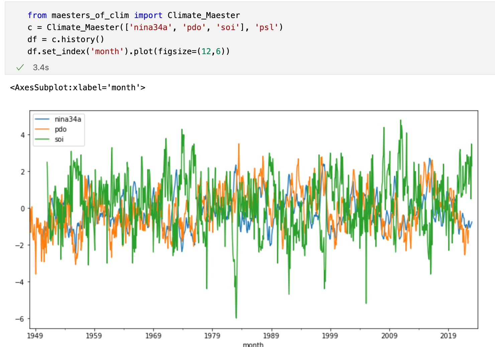

# Maesters-of-Clim



Maesters-of-Clim tempt to help retriving climate data (climate index, reanalysis) from the main-stream climate insitution (like IRI, PSL, NCEI, RDA). 

The following support

|Institution|Source|DataType|DataName|
|--|--|--|--|
|IRI|IRI|forecast|ENSO Probability|
|IRI|CPC|Forecast|ENSO Probability|
|PSL/NCEI|PSL/NCEI|history|Nina 34 Anomaly|
|PSL/NCEI|PSL/NCEI|history|Nina 3 Anomaly|
|PSL/NCEI|PSL/NCEI|history|Nina 4 Anomaly|
|PSL|PSL|history|Nina 1 Anomaly|
|NCEI|NCEI|history|Nina 1.2 Anomaly|
|NCEI|NCEI|history|Nina 1.2 SST|
|NCEI|NCEI|history|Nina 3 SST|
|NCEI|NCEI|history|Nina 3.4 SST|
|NCEI|NCEI|history|Nina 4 SST|
|NCEI|NCEI|history|Indian Ocean Dipole|
|PSL|PSL|history|Southern Oscillation Index|
|PSL|PSL|history|Oceanic Nino index|
|PSL|PSL|history|Trans Nino index|
|PSL|PSL|history|Arctic Oscillation|
|PSL|PSL|history|Bivariate ENSO from nina3.4 & soi|
|PSL|PSL|history|Western Pacific Index|
|PSL|PSL|history|AMO smoothed|
|PSL/NCEI|PSL/NCEI|history|AMO unsmoothed|
|PSL/NCEI|PSL/NCEI|history|Pacific Decadal Oscillation|


### Install
```shell
pip install maesters-clim==0.0.2
```

### Usage
```python
from maesters_of_clim import Climate_Maester
from datetime import datetime

# retrive history climate index from nina
c = Climate_Maester(
    indexes=['nina34a', 'pdo', 'soi'],
    source='psl'
)
df = c.history()

# retrive half-year ENSO forecast probability
c = Climate_Maester(
    indexes='enso',
    source='iri'
)
iridf = c.forecast(pred_at=datetime(2022, 10, 1))

c = Climate_Maester(
    indexes='enso',
    source='cpc'
)
cpcdf = c.forecast(pred_at=datetime(2022, 10, 1))

# calculate ENSO event from nina34a/nina3a/soi ...
from maesters_of_clim.analysis import enso_event
df['enso_event'] = enso_event(df, column='nina34a', temp=0.5, months=6)
df[~df['enso_event'].isna()]
```

## TODO

The following support is on the way. 🚀🚀🚀
> 1. Data
- [ ] ERA5 reanalysis from RDA and AWS

> 2. Basic Computation
- [ ] Compiste Analysis


